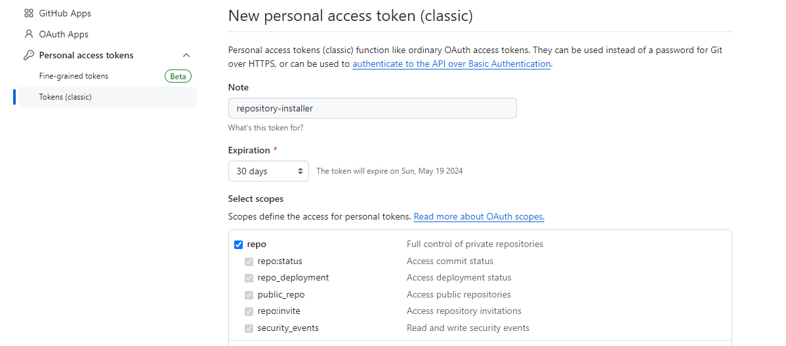

# installer - a configuration based repository installer


**installer** is a tool to help users to work with multiple *Git* repositories from the initial clone to getting updates.

**Where does it fit?**

I worked in a Java development team, we had about 15 repositories. I needed a simple tool which is

- Self-contained and updateable
- Configuration based
- Supports development `streams` (for example parallel tooling for java17, java21 etc.)
- *Git* only (minimal platform specific code)

and **nothing** more.

:bulb: I use the word *project* interchangeably with *repository*

## Table of contents

- [installer - a configuration based repository installer](#installer---a-configuration-based-repository-installer)
  - [Table of contents](#table-of-contents)
  - [Demo](#demo)
  - [Installation](#installation)
    - [Supported SCM types](#supported-scm-types)
      - [GitHub](#github)
        - [Token configuration](#token-configuration)
      - [BitBucket Enterprise](#bitbucket-enterprise)
        - [Token configuration](#token-configuration-1)
      - [Plain HTTP](#plain-http)
    - [Getting **installer** for the first time](#getting-installer-for-the-first-time)
    - [Prerequisites](#prerequisites)
  - [Configuration](#configuration)
    - [Workspace explained](#workspace-explained)
    - [Configuration file](#configuration-file)
  - [Usage](#usage)
    - [Options](#options)
      - [Options for development/testing](#options-for-developmenttesting)
    - [Link mode](#link-mode)
    - [Stream explained](#stream-explained)
    - [Commands](#commands)
      - [help](#help)
      - [list](#list)
      - [install](#install)
      - [update](#update)
  - [FAQ](#faq)
  - [Development notes](#development-notes)

---

## Demo


---

## Installation

For easier understanding of the initial steps, the following diagram provides an overview


To get started, you will need the following

- Configuration file aka `projects.json` (see [Configuration file](#configuration-file))

And these environment variables pointing to your configuration

- `INSTALLER_CONFIG_URL` - URL of the configuration `projects.json`
- `INSTALLER_CONFIG_SCM` - type of SCM (GitHub etc.) used for the configuration

If you are using GitHub, only `INSTALLER_CONFIG_URL` is needed.

:memo: For the best user experience, I recommend froking **installer** and set defaults according to your environment

### Supported SCM types

**installer** needs to know how to get the configuration file form the SCM without actually cloning it. This means assembling a URL used by `curl` to get the configuration. The following SCM types are supported:
  - github - GitHub *[default]*
  - bitbucket_server - Bitbucket Enterprise (server/data center)
  - plain - Plain HTTP

:bulb: This is only used for configuration file discovery, you can use any *Git* platform later for your projects. Authentication for *Git* commands are based on your *Git* configuration.

:warning: Bitbucket Cloud is not yet supported

#### GitHub

To get the configuration file the following URL format is used:

```
https://#token#@raw.githubusercontent.com/<user or organization>/<repo name>/#branch#/<path to file>/<file name>
```
The following variables are used in the URL:

- `#token#` is replaced with `INSTALLER_CONFIG_TOKEN` env. variable which holds your *Personal access token* or PAT
- `#branch#` is replaced with the currect branch (this done automatically)

##### Token configuration

To create token or PAT follow the offical guide [Creating a personal access token (classic)](https://docs.github.com/en/authentication/keeping-your-account-and-data-secure/managing-your-personal-access-tokens#creating-a-personal-access-token-classic)

Make sure you set `repo` scope (and nothing more) when creating the PAT.

.

:bulb: Token is needed for private repositories only

For example, using your private repositories would need the following settings:
```
export INSTALLER_CONFIG_URL=https://#token#@raw.githubusercontent.com/user/repo/#branch#/projects.json
export INSTALLER_CONFIG_TOKEN=1bacnotmyrealtoken123beefbea
```

#### BitBucket Enterprise

Since Bitbucket uses the URL's query string to specify the branch, there is no need to use special URL variables. The format is the following:

```
https://<server url>/projects/<project name>/repos/<repo name>/raw/<path to file>/<file name>?<branch>
```

##### Token configuration

To create token or `HTTP access token` follow the offical guide [HTTP access tokens](https://confluence.atlassian.com/bitbucketserver/http-access-tokens-939515499.html)

Make sure you set `Project read` and `Repository read` permissions (and nothing more) when creating the token.


Token is inserted in the header using `curl`

```
-H Authorization: Bearer ${token}
```

:bulb: Token is needed for private repositories only

For example, using your private repositories would need the following settings:
```
export INSTALLER_CONFIG_URL=https://contoso/projects/project/repos/repo/raw/projects.json
export INSTALLER_CONFIG_SCM=bitbucket_server
export INSTALLER_CONFIG_TOKEN=1bacnotmyrealtoken123beefbea
```

#### Plain HTTP

This type is mainly used for testing and it's very similar to GitHub's format, only that `token` or any other authentication is not supported.

To get the configuration file the following URL format is used:

```
https://<server url>/<server path>/#branch#/<path to file>/<file name>
```
The following variables are used in the URL:

- `#branch#` is replaced with the current/working branch (this done by the script)

For example, using your `localhost` server for configuration:
```
export INSTALLER_CONFIG_URL=https://localhost:8080/folder/#branch#/projects.json
```

Branches are simply folders like `main`, `master` etc.

:memo: You can set these variables in `~/.profile` or `~/.bashrc` to make them permanent

### Getting **installer** for the first time

Next get the **installer** with `curl` for the first time

```bash
curl -L https://raw.githubusercontent.com/bvarnai/respository-installer/main/src/installer.sh -o installer.sh && chmod +x installer.sh
```

Finally run **installer** in the current working directory.

```bash
./installer.sh
```
:tada: Once downloaded **installer** will upgrade itself, no need to run `curl` again.

### Prerequisites

Following tools are required and must be installed
  - `git`
  - `curl`
  - `sed`
  - `uname`
  - `bash` >= 4.0.0

:warning: [jq](https://jqlang.github.io/jq/) is downloaded by **installer** to bootstrap itself if not available. This step is platform specific

Supported platforms
- Linux amd64
- Windows amd64
  - [Git for Windows](https://gitforwindows.org/) 64 bit version
    - Tested with 2.41.0+

## Configuration

### Workspace explained

Workspace is the directory where your repositories/projects are cloned. It's also the current working directory where **installer** runs. Pojects in the configuration
are specified *relative* to this directory.

Example layout with `installer.sh` present
```
workspace-root
  .installer
  project1
  project2
  subfolder/project3
  installer.sh
  projects.json
```

:memo: `.installer` directory is a "temp" directory used to store the configuration and other dependencies such as `jq` if any

### Configuration file

The configuration file is called `projects.json` and it's downloaded using the `INSTALLER_CONFIG_URL` environment variable. It contains information about all your *Git* projects, including setup instructions.

```json
{
  "bootstrap": "myproject",
  "projects": [
    {
      "name": "myproject",
      "category": "development",
      "default": "true",
      "urls": {
        "fetch": "https://github.com/octocat/Hello-World.git",
        "push": "git@github.com:octocat/Hello-World.git"
      },
      "options": {
        "clone": "--depth 1"
      },
      "configuration": [
        "core.autocrlf false",
        "core.safecrlf false"
      ],
      "branch": "master",
      "update": "true",
      "doLast": [
        "./do_something.sh"
      ]
    }
  ]
}
```

| Elements       |                          |       | Description |
| -------------- | ------------------------ | ----  | ----------- |
| bootstrap      |                          |       | Bootstrap project is always added implicitly. Referenced by `name` in `projects`          |
| projects       |                          |       | Array of projects |
|                | name                     |       | Project name |
|                | path                     |       | Project path. Relative to workspace root. If not specified `name` will be used as path *[optional]* |
|                | category                 |       | Project category. Informal tagging of projects. Displayed during project listing *[optional]* |
|                | default                  |       | Whether to install the project if no project set is specified |
|                | urls                     |       | *Git* repository URLs |
|                |                          | fetch | URL used for `fetch` |
|                |                          | push  | URL used for `push`. If not specified `fetch` URL will be used *[optional]* |
|                | options                  |       | *Git* command options |
|                |                          | clone | Options for `clone` command. For example `--depth 1`" would result in a shallow clone *[optional]* |
|                | configuration            |       | Array of *Git* configuration `config` options, repository scope. Add `--global` for global scope *[optional]* |
|                | branch                   |       | Default branch |
|                | update                   |       | Whether to force the repository update and reset to latest on the default branch |
|                | doLast                   |       | Array of shell commands to execute after repository update *[optional]* |


:memo: Additional notes
- A bootstrap project is simply a project that is always installed
- :warning: A bootstrap project must be set to default `default==true` as well
- Different `fetch` and `push` URLs can be used to reduce load in *Git* hosting server, for example use `https` for `fetch` and `ssh` for `push`
- Setting `update==false` means repositories are fetched but not updated. This is desirable for development projects, so working branches are felt unchanged
- :warning: Setting `update==true` means repositories are fetched, reset and updated. This also means the branch will be switched to the default branch

:bulb: You can use a bootstrap project to host your DevOps scripts etc. for example doLast scripts

## Usage

Command syntax is the following:

```bash
./installer.sh [options] [<command>] [arguments]
```

Optional elements are shown in brackets []. For example, command may take a list of projects as an argument.

### Options

- `-y, --yes` - skip user prompts
- `--link` - use symlinks to target directory
- `--branch` - overrides `branch` setting in configuration
- `--stream` - specifies the `stream` of the configuration
- `--fetch-all` - fetches all remotes, branches
- `--prune` - prune during fetch
- `--git-quiet` - pass quite to git commands (not everything is suppressed)
- `--skip-dolast` - do not run doLast commends (useful in CI environments where some setup is not wanted)

#### Options for development/testing

- `--skip-self-update` - skip the script update step
- `--use-local-config` - use a local configuration file

### Link mode

In some cases, you don't want to have a fresh clone of a project to save some time. For example *Jenkins* multibanch pipeline would create a new workspace and make a fresh clone in using **installer**. This is where `link` mode can help.

Let see an example *Jenkinsfile*

```groovy
pipeline {

    environment {

        // installer configuration
        INSTALLER_SELF_URL = 'https://raw.githubusercontent.com/bvarnai/respository-installer/main/src/installer.sh'
        INSTALLER_CONFIG_URL = 'https://raw.githubusercontent.com/bvarnai/respository-installer/#branch#/src/projects.json'

        // use a directory outside of job's workspace
        SHARED_WORKSPACE = "${WORKSPACE}/../shared_workspace"
    }

    stages {
        stage('Prepare workspace') {
            steps {
                // install dependencies
                sh '''
                mkdir -p ${SHARED_WORKSPACE}

                curl -s -o installer.sh -L ${INSTALLER_SELF_URL} && chmod +x installer.sh
                ./installer.sh --yes --link ${SHARED_WORKSPACE} myproject1 myproject2
                '''
            }
        }
        stage ('Next') {
            steps {
              ...
            }
        }
    }
}
```

This will create symlinks `myproject1` and `myproject2` in the job's workspace, pointing to `../shared_workspace/myproject1` and `../shared_workspace/myproject2` directories respectively.

:warning: If you have multiple executors, parallel jobs might be running on the same shared workspace directory. This can be prevented by using the `EXECUTOR_NUMBER` variable

```groovy
SHARED_WORKSPACE = "${WORKSPACE}/../shared_workspace/${EXECUTOR_NUMBER}"
```

### Stream explained

For example the team is working on a "theoretical" Java update, migrating from Java 8 to Java 17. In the development project repository, they created a branch `java17` and started to work. However `master` development continues on Java 8 until everything is ready. `java17` branch needs the Java 17 JDK, tools etc. This means there are two parallel `stream`s of development. There will be two `projects.json` files on the corresponding branches with default branches set to `master` or `java17`.

If a developer works on `java17` branch, simply switches tooling to that stream
```
./installer.sh --stream java17 update
```

Other developer who remains on `master` just continues as
```
./installer.sh --stream master update
```

### Commands

The following commands are available. For options see [Options](#options)

---
#### help

```bash
./installer.sh help
```

Displays the help.

---
#### list

```bash
./installer.sh list
```

Lists available projects.

---
#### install

```bash
./installer.sh install [project...]
```

Installs a project(s). This is the default command, if nothing else is specified.

Arguments:

- `project` - the list of projects to install separated by a whitespace

:memo: If you run `install` without any arguments, all projects marked `default==true` will be installed

---
#### update

```bash
./installer.sh update
```

Updates existing projects in the current directory.

---

## FAQ

To be added. If you have any question, just create an issue and I will respond.

## Development notes

- I used Google's [Shell Style Guide](https://google.github.io/styleguide/shellguide.html) with the help of [ShellCheck](https://www.shellcheck.net/)
- Tests written in [Bats-core: Bash Automated Testing System](https://github.com/bats-core/bats-core)
